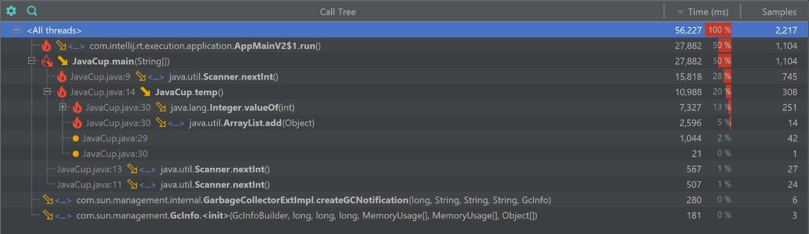
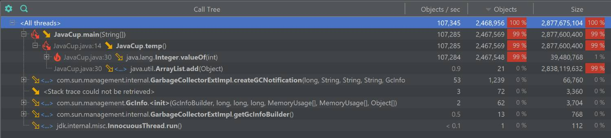

# گزارش آزمایش ششم - profiling

## مشخصات اعضای گروه

| نام و نام خانوادگی | شماره دانشجویی |
| ------------------ | -------------- |
|      ۴۰۱۱۰۵۸۳۷              |          مهسا حاجی رحیمی      |
|          ۴۰۲۱۰۶۲۳۱          |         فربد فتاحی       |

## گزارش بخش اول: پروفایلینگ و بهینه‌سازی  JavaCup

در این بخش، با استفاده از ابزار **YourKit Java Profiler**، وضعیت مصرف منابع (CPU و Memory) در برنامه بررسی شد تا گلوگاه‌های عملکردی (Bottlenecks) در اجرای متد `temp()` شناسایی و بهینه‌سازی شوند.

### ۱. وضعیت مصرف منابع قبل از بهینه‌سازی
در اجرای اولیه برنامه، پروفایلر به وضوح نشان داد که متد `temp()` مقصر اصلی هدررفت منابع سیستم است. دلیل اصلی این مشکل، استفاده از `ArrayList` برای نگهداری اعداد و وقوع عملیات سنگین Autoboxing (تبدیل نوع پایه `int` به شیء `Integer`) در یک حلقه تودرتو با تکرار بسیار بالا بود.

* **مصرف پردازنده (CPU):** همان‌طور که در نمودارهای درخت فراخوانی (Call Tree) و لیست متدها مشخص است، توابع مرتبط با متد `temp` (به ویژه `Integer.valueOf` و `ArrayList.add`) بار پردازشی بسیار بالایی ایجاد کرده و بخش عمده‌ای از زمان اجرای برنامه (بیش از ۱۰ ثانیه) را به خود اختصاص داده‌اند.

  
  

* **تخصیص حافظه (Memory Allocations):** پروفایل‌گیری از حافظه نشان داد که متد `temp` یک فاجعه در مدیریت رم ایجاد کرده است. این متد به تنهایی باعث تخصیص حدود **۲.۸ گیگابایت** حافظه و ساخت میلیون‌ها آبجکت اضافی در RAM شده است.

  

---

### ۲. استراتژی بهینه‌سازی کد
برای رفع این گلوگاه، استراتژی ذخیره‌سازی تغییر یافت.
استفاده از `ArrayList` به طور کامل حذف شد و به جای ذخیره تک‌تک عناصر در حافظه (که منجر به تولید ۲۰۰ میلیون شیء `Integer` می‌شد)، منطق کد به انجام محاسبات ریاضی روی متغیرهای پایه (Primitive Types) تغییر کرد. این استراتژی نیاز به تخصیص پویای حافظه (Dynamic Allocation) را کاملاً از بین می‌برد.

---

### ۳. وضعیت مصرف منابع پس از بهینه‌سازی
پس از اعمال تغییرات در کد، برنامه مجدداً کامپایل و توسط YourKit ارزیابی شد. نتایج جدید نشان‌دهنده یک بهبود بنیادین در عملکرد برنامه است:

* **بهبود چشمگیر پردازنده (CPU):** در اسنپ‌شات‌های جدید، زمان اجرای متد `temp` به قدری کاهش یافته که کلاً از صدر لیست توابع پرمصرف حذف شده است. زمان‌های ثبت شده در این مرحله عمدتاً مربوط به توقف طبیعی برنامه برای دریافت ورودی از کاربر (`Scanner.nextInt`) می‌باشد.

  
  

* **حذف کامل سربار حافظه (Zero Allocations):** بررسی وضعیت مموری نشان می‌دهد که تخصیص ۲.۸ گیگابایتی کاملاً از بین رفته است. متد `temp` دیگر هیچ شیء جدیدی در حافظه نمی‌سازد و مصرف رمِ آن بهینه شده است.

  
