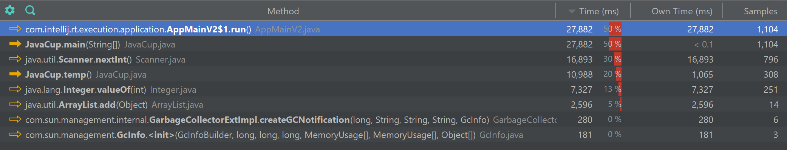
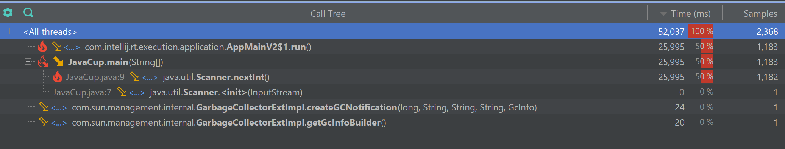
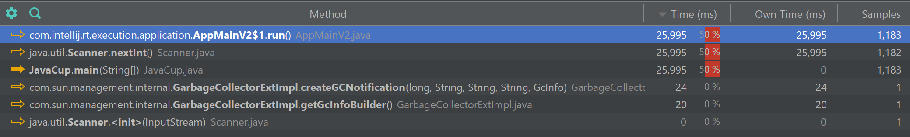
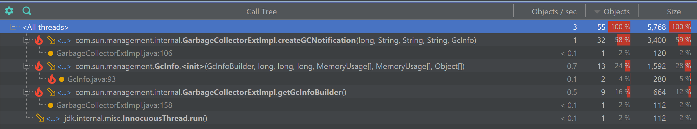
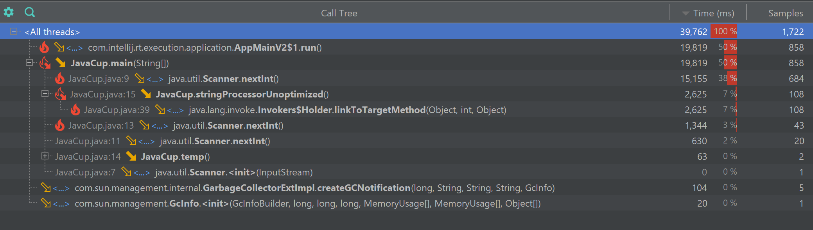
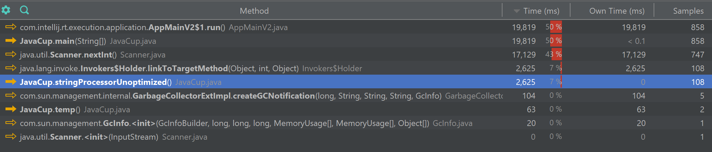
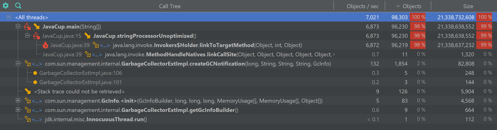
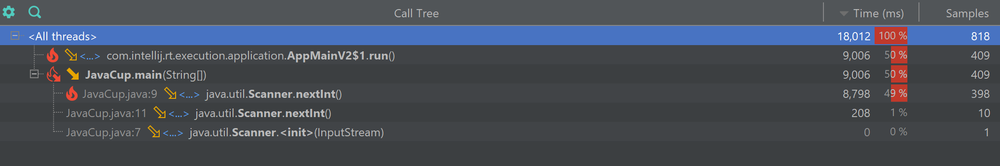
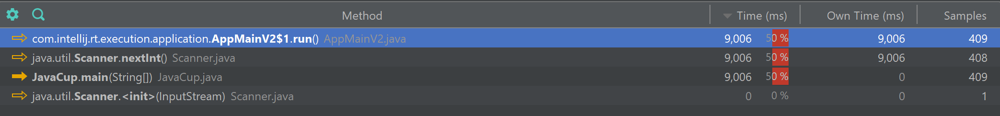
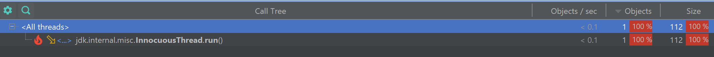

# گزارش آزمایش ششم - profiling

## مشخصات اعضای گروه

| نام و نام خانوادگی | شماره دانشجویی |
| ------------------ | -------------- |
|      ۴۰۱۱۰۵۸۳۷              |          مهسا حاجی رحیمی      |
|          ۴۰۲۱۰۶۲۳۱          |         فربد فتاحی       |


## گزارش بخش اول: پروفایلینگ و بهینه‌سازی  JavaCup

در این بخش، با استفاده از ابزار **YourKit Java Profiler**، وضعیت مصرف منابع (CPU و Memory) در برنامه بررسی شد تا گلوگاه‌های عملکردی (Bottlenecks) در اجرای متد `temp()` شناسایی و بهینه‌سازی شوند.

### ۱. وضعیت مصرف منابع قبل از بهینه‌سازی
در اجرای اولیه برنامه، پروفایلر به وضوح نشان داد که متد `temp()` مقصر اصلی هدررفت منابع سیستم است. دلیل اصلی این مشکل، استفاده از `ArrayList` برای نگهداری اعداد و وقوع عملیات سنگین Autoboxing (تبدیل نوع پایه `int` به شیء `Integer`) در یک حلقه تودرتو با تکرار بسیار بالا بود.

* **مصرف پردازنده (CPU):** همان‌طور که در نمودارهای درخت فراخوانی (Call Tree) و لیست متدها مشخص است، توابع مرتبط با متد `temp` (به ویژه `Integer.valueOf` و `ArrayList.add`) بار پردازشی بسیار بالایی ایجاد کرده و بخش عمده‌ای از زمان اجرای برنامه (بیش از ۱۰ ثانیه) را به خود اختصاص داده‌اند.

  
  

* **تخصیص حافظه (Memory Allocations):** پروفایل‌گیری از حافظه نشان داد که متد `temp` یک فاجعه در مدیریت رم ایجاد کرده است. این متد به تنهایی باعث تخصیص حدود **۲.۸ گیگابایت** حافظه و ساخت میلیون‌ها آبجکت اضافی در RAM شده است.

  

---

### ۲. استراتژی بهینه‌سازی کد
برای رفع این گلوگاه، استراتژی ذخیره‌سازی تغییر یافت.
استفاده از `ArrayList` به طور کامل حذف شد و به جای ذخیره تک‌تک عناصر در حافظه (که منجر به تولید ۲۰۰ میلیون شیء `Integer` می‌شد)، منطق کد به انجام محاسبات ریاضی روی متغیرهای پایه (Primitive Types) تغییر کرد. این استراتژی نیاز به تخصیص پویای حافظه (Dynamic Allocation) را کاملاً از بین می‌برد.

---

### ۳. وضعیت مصرف منابع پس از بهینه‌سازی
پس از اعمال تغییرات در کد، برنامه مجدداً کامپایل و توسط YourKit ارزیابی شد. نتایج جدید نشان‌دهنده یک بهبود بنیادین در عملکرد برنامه است:

* **بهبود چشمگیر پردازنده (CPU):** در اسنپ‌شات‌های جدید، زمان اجرای متد `temp` به قدری کاهش یافته که کلاً از صدر لیست توابع پرمصرف حذف شده است. زمان‌های ثبت شده در این مرحله عمدتاً مربوط به توقف طبیعی برنامه برای دریافت ورودی از کاربر (`Scanner.nextInt`) می‌باشد.

  
  

* **حذف کامل سربار حافظه (Zero Allocations):** بررسی وضعیت مموری نشان می‌دهد که تخصیص ۲.۸ گیگابایتی کاملاً از بین رفته است. متد `temp` دیگر هیچ شیء جدیدی در حافظه نمی‌سازد و مصرف رمِ آن بهینه شده است.

  

## گزارش بخش دوم: پروفایلینگ قطعه کد جدید

در این بخش مشابه قسمت قبل ابتدا تابعی غیر بهینه در کلاس javacup ایجاد کرده و سپس با کمک پروفایلینگ آن را بررسی کرده و بهینه سازی می کنیم.

### 1. قطعه کد غیر بهینه جدید
در این قسمت تابعی که اضافه می کنیم تابعی برای concat کردن رشته ها در جاوا است که در این روش به صورت زیر پیاده سازی شده است.

```java
public static void stringProcessorUnoptimized() {
        String result = "";
        for (int i = 0; i < 100000; i++) {
            result += i;
        }
        System.out.println("Unoptimized processing done. Length: " + result.length());
    }

```

در این حالت چون از قابلیت StringBuilder در جاوا استفاده نشده است، تعداد اشیا ساخته شده زیاد می شود و در نتیجه عملکرد تابع بهینه نخواهد بود.

### 2. پروفایلینگ کد غیر بهینه
در این بخش برای بررسی ادعای خود با ابزار yourkit کد را مشابه بخش اول آزمایش پروفایل می کنیم و مصرف منابع آن را بررسی می کنیم.

وضعیت CPU در طول اجرای کد غیر بهینه:



وضعیت حافظه در طول اجرای کد غیر بهینه:


همانطور که در توابع بالا مشخص است تابع جدید تعریف شده در هر دو متریک ضعیف عمل می کند.

### 3. جایگزینی با کد بهینه
در این قسمت تابع جدیدی تعریف می کنیم که این بار از StringBuilder استفاده بکنیم.
```java
public static void stringProcessorOptimized() {
        StringBuilder sb = new StringBuilder();
        for (int i = 0; i < 100000; i++) {
            sb.append(i);
        }
        String result = sb.toString();
        System.out.println("Optimized processing done. Length: " + result.length());
    }

```

در این روش جدید دیگر احتیاجی به ساخته شدن شی برای هر بار تغییر رشته نیست و در نتیجه انتظار داریم عملکرد بهتر شود.

### 4. پروفایلینگ کد بهینه سازی شده
در این بخش نیز مشابه بخش قبل همان متریک ها را برای اجرای کد جدید بررسی می کنیم.

وضعیت CPU در طول اجرای کد بهینه سازی شده:



وضعیت حافظه در طول اجرای کد بهینه سازی شده:


همانطور که انتظار داشتیم در کد بهینه سازی شده تابع جدید دیگر از منابع به طور مناسب و کم استفاده می کند.
